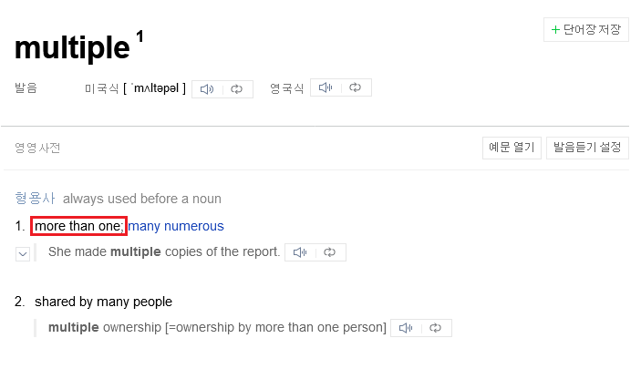

# 진짜 최종 구데기컵 2 2 에디토리얼

(하고 싶은 말)

## 들어가기 전에

올해 구데기컵을 부활시키기 위해 제2회 진짜 최종 구데기컵 2를 열었습니다. 대회 이름에 2가 두 개고 마침 2022년이라서 시작 시각도 22:22:22고 만점도 222,222점입니다.

* "셀 수 없는 문제를 해결하신 모든 분들께 solved.ac 배경과 뱃지를 드립니다": 문제 번호가 자연수가 아니라서 셀 수 없습니다. 아무 문제나 하나 풀면 드립니다.
* "⅔ 이하의 인터랙티브 문제가 출제될 예정입니다": 원래는 문제 번호가 ⅔번 이하인 인터랙티브 문제를 출제하려고 했는데, 수식에 이모지를 섞어넣을 수 있다는 사실을 알아버렸습니다. 이제부터 📏 < 0입니다.

## 번. 한별 찍기
_출제자: shiftpsh,_
_최고 득점자: shiftpsh (0분, 0점)_

예제에 주어진 한별이를 그대로 출력하면 됩니다. 노 솔브 방지용 문제입니다.

## 번. Binary Game 2

_출제자: jh05013_

_최고 득점자: watson_amelia (0분, 0점)_

만점을 받으려면 **C++, Java, Swift, Ruby로 모두 컴파일 가능한 하나의 코드**를 제출해야 한다. 이런 코드를 [polyglot](https://en.wikipedia.org/wiki/Polyglot_(computing))이라고 한다.

### C++ & Swift
Polyglot을 작성하는 좋은 방법은 주석을 활용하는 것이다. 한 언어에서 주석이고 다른 언어에서 주석이 아닌 공간을 만들면, 그 공간에서는 한 언어의 문법을 신경쓰지 않고 다른 언어를 자유롭게 쓸 수 있기 때문이다.

C++과 Swift의 주석 기호는 `//`와 `/* */`로 동일하지만, 한 가지 중요한 차이는 Swift에서만 `/* /* */ */` 같은 식의 다중 주석을 쓸 수 있다는 것이다. 따라서 `/* /* */`로 Swift에서는 주석이고, C++에서는 주석이 아닌 공간을 만들 수 있다. 이제 문제를 푸는 C++ 코드를 작성한 뒤, `// */`을 통해 C++에서는 주석이고, Swift에서는 주석이 아닌 공간을 만들면 된다. 딱 한 줄만 쓸 수 있다는 제약이 있지만, 어차피 모든 구문을 한 줄에 몰아 쓸 수 있으므로 상관없다.

```
/* /* */
cpp_code
// */ swift_code
```

### C++ & Ruby
Ruby는 한 줄 주석으로 `#`을, 여러 줄 주석으로 `=begin`과 `=end`를 사용한다. 단, `=begin`과 `=end`를 쓸 때는 그 줄에 주석 기호를 제외한 아무 것도 없어야 한다.

어차피 `#`은 C++에서도 헤더를 include하기 위해 쓰일 테니까, iostream을 include하는 동시에 Ruby에서 주석인 공간을 만들자. 같은 줄에 `/*`을 쓰면 그 다음 줄은 Ruby에서만 주석이 아닌 공간이 되므로 자유롭게 Ruby 코드를 작성할 수 있다. 그 다음 줄에 `=begin`으로 Ruby 주석을 시작하고, `*/`으로 C++ 주석을 닫으면 C++ 코드를 작성할 수 있다. 이제 같은 방식으로 `=end`를 넣어주면 된다.

```
#include <iostream> /*
ruby_code
=begin
*/
cpp_code
/*
=end
# */
```

### C++ & Swift & Ruby
`#if true`와 `#endif`는 C++과 Swift에서 모두 유효한 지시문이다. 따라서 위의 두 테크닉을 적절히 조합하여 풀 수 있다.

```
#if true /*
ruby_code
=begin
/* */
cpp_code
// */ swift_code
#endif
/*
=end
# */
```

### C++ & Java
Java에서는 모든 문자를 `\uxxxx`의 형태로 쓸 수 있다. 심지어 개행 문자도 `\u000a`으로 쓸 수 있고, Java는 이를 진짜로 개행 문자로 취급하고 `//` 주석을 해제한다. 이를 사용하면 C++에서만 주석인 공간을 쉽게 만들 수 있다.

```
// \u000a java_code /*
cpp_code
// */
```

추가로, `//` 주석이 있는 줄의 마지막에 `\`이 오면 C++에서만 다음 줄도 주석이 된다. 출제자의 풀이는 이 테크닉을 사용하지 않는다.

### C++ & Java & Swift & Ruby
이제 C++ & Swift & Ruby 코드에 위의 `\u000a` 테크닉을 적용하여 Java 코드를 넣어주면 된다. 우연히도 `//`는 Ruby에서 empty regex로 인식하기 때문에, `//; #`을 사용하여 모든 언어에서 주석인 공간을 만들 수 있다. 여기에 `\u000a`를 쓰면 Java에서만 주석이 아닌 공간이 만들어진다.

그 다음 줄부터는 모든 공간을 주석으로 만들어야 한다. 그러려면 주석이 해제될 때마다 주석을 다시 달아야 하고, 이는 `// \u000a /*`로 해결할 수 있다.

```
//; # \u000a java_code /*
#if true /*
ruby_code
=begin
/* */ // \u000a /*
cpp_code
// */
// */ swift_code // \u000a /*
#endif
/*
=end
# */
```

## 번. Fewest Moves Challenge

_출제자: kipa00,_
_최고 득점자: kipa00 (0분, 0점)_

Fewest Moves Challenge를 알아야 할 것처럼 방대한 분량으로 잔뜩 설명되어 있는데, **다 필요없고** [Thistlethwaite's 4-phase Algorithm](https://www.jaapsch.net/puzzles/thistle.htm)이 평균 31 회전 정도에 큐브를 맞추므로 이 알고리즘을 구현하면 됩니다. 신의 수를 구하는 데 사용되어 익히 알려진 [Kociemba's 2-phase Algorithm](http://kociemba.org/twophase.htm)은 모든 큐브를 30 회전 안에 맞출 수 있으나, 전처리 과정이 너무 길고 `constexpr` 등을 사용할 경우 파일의 크기가 너무 커져서 이 문제에서는 사용이 거의 불가능합니다.

굳이 WCA 규칙을 적어놓은 이유는, WCA 권고사항에 따라 **불필요한 이동이 없는 25 회전 스크램블**만을 입력으로 사용했기 때문입니다. 따라서 superflip 등 다루기 복잡한 상태만 입력으로 들어오는 것은 생각하지 않으셔도 됩니다.

정해 풀이와 상관없이 FMC는 재밌으니 문제에서 부분 점수를 받으신 분은 저와 함께 FMC를 해 주실 거라 믿습니다.

아래는 4-phase algorithm을 구현할 때 신경써야 할 부분입니다. 1981년 원본 논문에서는 대칭이동 등을 고려해서 테이블의 크기를 줄이는 경우 몇 시간 정도가 소요된다고 적혀 있지만, *40년 동안 컴퓨터가 엄청나게 빨라지기도 했고* 아래 적힌 알고리즘 최적화를 모두 시행하면 전처리에 고작 **200ms**도 걸리지 않습니다.

### Phase 1

2 048개의 경우밖에 안 되지만, 그냥 BFS 전처리를 해 두는 것이 정신 건강에 좋습니다.

### Phase 2

경우의 수는 1 082 565가지이며 큐브의 스티커는 총 54개이므로 전처리에 상당한 시간이 소요됩니다. 이 시간을 줄이기 위해, 코너와 엣지는 항상 서로 다른 위치에 있다는 사실을 이용합시다.

- 코너는 총 3<sup>7</sup> = 2 187가지이고 가능한 모든 14가지의 연산에 대해 미리 어떤 상태로 가는지 전처리를 해 둡시다. 스티커는 코너의 24개만 보면 됩니다. 
- 마찬가지로 엣지는 총 <sub>12</sub>C<sub>4</sub> = 495가지이고 가능한 모든 14가지의 연산에 대해 어떤 상태로 가는지 전처리합니다. 스티커는, 1단계에서 이미 엣지 오리엔테이션을 정렬했으므로 올바른 엣지 스티커 12개만 보면 됩니다.

이 연산 정보를 사용하여 1 082 565개의 상태를 BFS로 전부 탐색하면, 연산하는 데 큐브를 직접 돌려볼 필요가 없으므로 전처리 속도가 대단히 빨라집니다.

### Phase 3

연산이 가장 힘든 부분입니다. 역시 코너와 엣지로 쪼개되, 다른 phase와 달리 코너의 경우 G<sub>2</sub>/G<sub>3</sub>가 group이 **되지 않는다**는 사실에 주의해야 합니다.

- 따라서 coset의 코너의 factor가 420임에도 불구하고 코너의 경우는 어쩔 수 없이 8! = 40 320가지의 경우를 다 봐 줘야 합니다. 가능한 연산 개수는 10가지이고, 스티커는 2단계에서 코너 오리엔테이션을 정렬했으므로 8개만 보면 됩니다.
- 엣지의 경우에는 subgroup이 되므로 각각의 위치에 넣어주기만 하면 되며, 70가지를 봐 주면 됩니다. 마찬가지로 가능한 연산 개수는 10가지이고, 스티커는 12개만 보면 됩니다.

이제, 이 연산 정보를 합쳐서 2 822 400개의 상태에 대해 96개의 초기 상태에서 multi-source BFS를 시행합니다.

### Phase 4

Phase 2와 마찬가지로, 코너와 엣지를 쪼개어 계산하면 됩니다. 여기까지 되었다면, 실제로 남은 상태의 개수가 663 552개이므로 특별히 더 어려운 부분은 없습니다.

### 부분 점수에 대해

- 초보자용 해법은 평균 110-120 회전이 소모되므로 점수를 받을 수 없습니다.
- CFOP 해법은 최적화하지 않으면 평균 60-65 회전 정도가 소모되고, 최적화하면 평균 55-60 회전 정도가 소모됩니다. 65 회전의 경우 3 472.22점, 55 회전의 경우 13 888.88점 정도를 얻을 수 있습니다.
- Roux 해법은 평균 48 회전 정도가 소모됩니다. 평균 48 회전의 경우 받을 수 있는 점수는 36 652.96점입니다.
- Petrus 해법에 ZBLL을 섞으면 평균 40-45 회전 정도가 소모됩니다. 평균 40 회전의 경우 받을 수 있는 점수는 111 111점입니다. 여기에 ZBLL 대신 본문에 소개된 AB5C + Insertion을 사용하면 점수를 조금 더 받을 수 있을지도 모릅니다.
- 평균 40 회전부터는 1 회전을 줄이는 것이 최소 16 000점에서 최대 29 000점까지 차이가 나므로, 생각보다 점수를 못 받고 있다면 혹시 한 번에 할 수 있는 이동을 두 번으로 나누어 출력했거나(R R2는 R'으로 출력할 수 있습니다) 불필요한 U 면 회전이 없는지 확인합시다.

35 회전에 가까워질수록 비슷한 회전수에 대해서 점수 간격을 오히려 넓힌 이유는, 회전 수가 줄어들수록 회전 수를 더 줄이기 힘들기 때문이기도 하고, 계획한 알고리즘을 정확히 사용하지 않는 경우 점수 차이를 크게 주기 위해서이기도 합니다.

## 번. _multiple_ edges

_출제자: kipa00,_
_최고 득점자: kipa00 (0분, 0점)_

이 문제를 아무런 제약조건 없이 그냥 풀려고 하면 [링크 컷 트리](https://en.wikipedia.org/wiki/Link/cut_tree)를 사용해야 하고, 이마저도 시간 복잡도가 O(_q_ log _n_)이기 때문에 **500ms**의 시간 제한에 통과되기에는 역부족입니다.

문제 제목, 힌트 등 모든 **multiple**이라는 단어가 특이한 문구로 표시되어 있다는 사실에 주목합시다. **multiple**에는 "하나보다 많은"(more than one)이라는 뜻이 있습니다.



그렇다면 하나보다 많은 간선이 생길 수 없고 최초에 간선이 없기 때문에, 다음과 같은 관찰들을 할 수 있습니다.

- 현재 간선이 하나 있다면 답은 (*n* - 1)입니다.
- 현재 간선이 없다면 답은 *n*입니다.
- 간선이 없는 상태에서 들어오는 쿼리는 **반드시** 간선이 추가되는 쿼리입니다. 간선 제거 쿼리는 간선이 있었음이 보장되니까요.
- 간선이 하나 있는 상태에서 들어오는 쿼리는 **반드시** 그 간선이 제거되는 쿼리입니다. 간선 추가 쿼리는 이미 존재하는 간선에 들어올 수 없고, 다른 간선에 들어오면 곧바로 간선이 하나보다 많게 되니까요.

따라서, *n*과 *q*가 결정되면, 쿼리를 읽을 필요도 없이 (*n*-1)과 *n*을 번갈아서 총 *q*번 출력하면 됩니다.

사실 BOJ의 인터랙티브는 아주 느리기 때문에, 쿼리를 읽는 것만으로도 시간 초과가 날 수 있습니다. *n*과 *q*만 읽고 충분히 빠른 입출력인 `printf` 등을 사용하면 넉넉하게 만점을 받을 수 있습니다. 메모리에 충분한 양의 (*n*-1)과 *n*을 미리 작성해 두고, `write` 등 버퍼를 거치지 않는 입출력을 사용하면 **100ms** 정도를 줄일 수 있으나 필요하지 않습니다.

## 번. Baekjoon Wordline Judge

_출제자: jh05013_

_최고 득점자: mori_calliope (0분, 0점)_

[Wordle](https://en.wikipedia.org/wiki/Wordle) 275 3/6

```
⬜⬜⬜🟨🟨
🟩🟨⬜🟨🟩
🟩🟩🟩🟩🟩
```

## 번.  (=BOJ 문제 번호)
_출제자: shiftpsh,_
_최고 득점자: shiftpsh (0분, 0점)_

제출 번호가 몇 번이 부여될지 예상하고 잘 제출해야 합니다. 제출이 몰리지 않는 시간대에 시도한다면 맞을 가능성이 더 높아질 수 있습니다.

## 번. 문제 이름

_출제자: cozyyg_

_최고 득점자: ninomae_inanis (0분, 0점)_

## 번. 문제 이름
_출제자: shiftpsh,_
_최고 득점자: shiftpsh (0분, 0점)_

같은 번호, 같은 이름과 같은 지문의 문제 중 더 아래에 있는 문제였습니다. 출제자가 다른데, 위에 있는 문제는 실제로 출제자가 현재 훈련소에서 훈련을 받고 있고, 아래에 있는 문제는 출제자가 최근에 훈련소에서 수료했습니다.

solved.ac 슬랙/디스코드에 훈련소 편지 작성 링크를 미리 공지했던 만큼 편지를 6장만 썼어도 **쉽게 맞힐 수 있는** **노솔브 방지 문제**였습니다. 출제자가 훈련소에서 받은 편지는 106장이며 정답이 될 수 있는 단어는 총 92개입니다. 이 중 유추할 수 있을 법한 단어들을 소개합니다.

* `잘` ('`잘` 지내고 있나요?' 같은)
* `하이`
* `훈련소`
* `편지`
* `제목` (내용이 `제목`으로 시작하는 편지가 있어서 얻어걸릴 수 있었겠습니다)

아래 단어들은 안타깝게도 정답이 아닙니다.

* `안녕하세요` (`안녕하세요.`와 `안녕하세요,`는 있었습니다)
* `시프트`, `시프트님` 등

마지막으로 정말 유추하기 힘들었을 듯한 단어들을 몇 개만 소개합니다.

* `블라디미르`
* `次元の民`
* `https://youtu.be/JwqagN3t16A`
* `꽶윋뾆휊깶!`
* `##시간제한`

안타깝게도 코로나 확진으로 격리된 3월 5일 이후의 편지는 수령하지 못해서 정답에 없습니다.

## 번. 제1회 구데기그릇 (홀수형)

_출제자: jh05013, kipa00_

_최고 득점자: takanashi_kiara (0분, 0점)_

### 문제 1

_출제자: jh05013_

이 문제의 내용은 The Twelve Days of Christmas라는 노래이다. 이 노래는 12일째에 끝나며, 새는 1, 2, 3, 4, 6, 7일째에만 추가된다. 따라서 답은 수열 1, 3, 6, 10, 10, 16, 23, 23, 23, 23, 23, 23에서 첫 min(N, 12)개의 수의 합이다.

### 문제 2

_출제자: jh05013_

방법이 없을 때에만 "IMPOSSIBLE"을 출력하라고 하지 않았으므로, 그냥 "IMPOSSIBLE"을 출력하면 된다. 따옴표까지 출력해야 함에 유의하자.

### 문제 3

_출제자: jh05013, kipa00_

온도는 영하 273.15도 밑으로 내려갈 수 없기 때문에, n <= 27에 대해서만 N-퀸 문제를 풀면 된다. 우연히도 딱 여기까지 정확한 답이 알려져 있으므로, 이를 하드코딩하고 116으로 나눈 몫을 출력하면 된다. 10^9+7이 아니라 109+7이고, 나머지가 아니라 몫이라는 점을 유의하자.

### 문제 4

_출제자: jh05013_

### 문제 5

*문제가 너무 쉬워서 지문과 에디토리얼을 뒤바꾸었습니다.*

**문제**

BOJ에는 [소스 코드가](https://www.acmicpc.net/problem/1377) [그대로 주어진 문제](https://www.acmicpc.net/problem/20658)가 몇 개 있다. 그런 문제들의 공통점은 해당 소스 코드가 너무 느려서 실제로는 그 코드의 로직을 최적화하는 알고리즘을 찾아야 한다는 것이다.

하지만 코드의 로직조차 보이지 않는 문제라면 어떨까?

다음 소스 코드를 실행한 결과를 출력하시오.

```python
import calendar
print(calendar.calendar(int(input())))
```

**입력**

1900 이상 2022 이하의 자연수가 주어진다.

**출력**

프로그램의 실행 결과를 출력한다.

**예제 입력 1**

```
2022
```

**예제 출력 1**

```
                                  2022

      January                   February                   March
Mo Tu We Th Fr Sa Su      Mo Tu We Th Fr Sa Su      Mo Tu We Th Fr Sa Su
                1  2          1  2  3  4  5  6          1  2  3  4  5  6
 3  4  5  6  7  8  9       7  8  9 10 11 12 13       7  8  9 10 11 12 13
10 11 12 13 14 15 16      14 15 16 17 18 19 20      14 15 16 17 18 19 20
17 18 19 20 21 22 23      21 22 23 24 25 26 27      21 22 23 24 25 26 27
24 25 26 27 28 29 30      28                        28 29 30 31
31

       April                      May                       June
Mo Tu We Th Fr Sa Su      Mo Tu We Th Fr Sa Su      Mo Tu We Th Fr Sa Su
             1  2  3                         1             1  2  3  4  5
 4  5  6  7  8  9 10       2  3  4  5  6  7  8       6  7  8  9 10 11 12
11 12 13 14 15 16 17       9 10 11 12 13 14 15      13 14 15 16 17 18 19
18 19 20 21 22 23 24      16 17 18 19 20 21 22      20 21 22 23 24 25 26
25 26 27 28 29 30         23 24 25 26 27 28 29      27 28 29 30
                          30 31

        July                     August                  September
Mo Tu We Th Fr Sa Su      Mo Tu We Th Fr Sa Su      Mo Tu We Th Fr Sa Su
             1  2  3       1  2  3  4  5  6  7                1  2  3  4
 4  5  6  7  8  9 10       8  9 10 11 12 13 14       5  6  7  8  9 10 11
11 12 13 14 15 16 17      15 16 17 18 19 20 21      12 13 14 15 16 17 18
18 19 20 21 22 23 24      22 23 24 25 26 27 28      19 20 21 22 23 24 25
25 26 27 28 29 30 31      29 30 31                  26 27 28 29 30

      October                   November                  December
Mo Tu We Th Fr Sa Su      Mo Tu We Th Fr Sa Su      Mo Tu We Th Fr Sa Su
                1  2          1  2  3  4  5  6                1  2  3  4
 3  4  5  6  7  8  9       7  8  9 10 11 12 13       5  6  7  8  9 10 11
10 11 12 13 14 15 16      14 15 16 17 18 19 20      12 13 14 15 16 17 18
17 18 19 20 21 22 23      21 22 23 24 25 26 27      19 20 21 22 23 24 25
24 25 26 27 28 29 30      28 29 30                  26 27 28 29 30 31
31
```

### 문제 6

_출제자: kipa00_

### 문제 7

_출제자: jh05013_

유명한 행렬 거듭제곱 문제이다. 이 문제가 구데기컵에 있는 이유는 두 가지이다.
- **시간 제한이 매우 빡빡하다.** 이 문제를 통과하려면 높은 확률로 캐시 최적화가 필요할 것이다. 다행히도 행렬 곱셈에서의 캐시 최적화는 많이 연구가 된 분야이므로 관련 자료를 많이 찾아볼 수 있다.
- 만점을 받으려면 **문제 5를 C++로 풀어야 한다.** 참고로 각 줄의 끝에 공백이 있으면 안 됨에 유의하자.

### 문제 8

_출제자: kipa00_

### 문제 9

_출제자: jh05013_

대회에서 공지된 대로, 정답은 731706508이다.

대회 중에 홀수형과 짝수형에서 모두 점수를 받으려면 10초 안에 공지사항의 수를 복사하고, 이를 홀수형 코드에 붙여넣어 제출한 뒤, 짝수형 코드에도 붙여넣어 제출해야 한다. 이 모든 과정을 손으로 하기는 쉽지 않으므로 많은 과정을 미리 자동화하여 대비하는 것이 좋다. 출제자는 다음과 같은 방법으로 7초 내에 두 문제에 모두 제출하는 데에 성공했다.
- 한 프로그램을 미리 작성해 놓는다. 이 프로그램은 하나의 수를 입력으로 받고, 이를 홀수형 코드에 끼워넣어 클립보드에 복사한 다음, 3초 후에 같은 수를 짝수형 코드에 끼워넣어 클립보드에 복사한다. 클립보드 복사를 하려면 [clipboard](https://pypi.org/project/clipboard/) 모듈 등을 사용하면 된다.
- 공지사항, 홀수형 제출 페이지, 짝수형 제출 페이지로 총 3개의 탭을 띄워 놓는다.
- 타이밍에 맞춰서 공지사항을 새로고침한 뒤, 수를 복사하여 프로그램에 붙여넣고, 자동으로 복사된 홀수형 코드를 즉시 홀수형 제출 페이지에 붙여넣고 제출한다.
- 적당히 1~2초 기다린 다음, 짝수형 제출 페이지에 새로 복사된 코드를 제출한다.

키보드, 마우스 매크로를 잘 설계하면 자동화 비율을 좀 더 높일 수 있다.

## 번. 제1회 구데기그릇 (짝수형)

_출제자: kipa00, jh05013_

_최고 득점자: takanashi_kiara (0분, 0점)_

_Marked as duplicate._

## 번. 하이퍼하게 누울 하이퍼 자리를 찾아라
_출제자: shiftpsh,_
_최고 득점자: shiftpsh (0분, 0점)_

[누울 자리를 찾아라](https://www.acmicpc.net/problem/1652)의 11차원 버전입니다. 입력이 sparse하게 들어온다는 차이점이 있습니다. 이를 잘 이용해 봅시다.

### 서브태스크 1 (11,111점)
[누울 자리를 찾아라](https://www.acmicpc.net/problem/1652)를 풀듯이 풀면 됩니다. 복잡도 O(_N_<sup>11</sup>)에 해결할 수 있습니다.

### 서브태스크 2 (100,000점)
위와 같은 방법으로 풀면 시간과 공간이 부족합니다(50<sup>11</sup> ~= 4 &times; 10<sup>18</sup>).

우선 1차원에서부터 차근차근 생각해 봅시다. 예를 들어, _N_ = 10이고, 2, 6 위치에 짐이 놓여 있다면 

<p align="center">
🔲⬛🔲🔲🔲⬛🔲🔲🔲🔲
</p>

와 같은 상태가 되고, 잠을 잘 수 있는 공간은 가운데 세 칸과 맨 오른쪽 네 칸으로 2곳입니다.

생각하기 쉽게 0, <em>N</em> + 1 (=11) 위치에 추가로 짐을 놓는다고 가정하고, 이를 배열 [0, 2, 6, 11]로 나타냅시다. 잠을 잘 수 있는 공간은 이 배열에서 인접한 값이 3 이상 차이나는 경우의 수라는 것을 알 수 있습니다. 따라서 1차원의 경우에는 배열을 정렬한 후 이런 경우의 수를 세 주면 되며, 이는 <em>N</em>과 상관없는 O(<em>K</em> log <em>K</em>) 알고리즘입니다.

다시 11차원으로 돌아오면, 이런 1차원 공간이 축마다 <em>N</em><sup>10</sup>개로 총 11<em>N</em><sup>10</sup>개가 존재함을 알 수 있습니다. 여전히 꽤 큰 수입니다.

하지만 짐이 <em>K</em>개밖에 없으므로, 짐이 존재하는 1차원 공간도 11<em>K</em> 개까지밖에 존재할 수 없습니다. 짐이 존재하는 1차원 공간만 고려해 준다면 O(<em>K</em> log <em>K</em>)만에 문제를 해결할 수 있습니다.

### 서브태스크 3 (111,111점)
이 문제의 출력이 될 수 있는 수는 <em>N</em><sup>10</sup> + O(<em>K</em>)입니다. 5,000<sup>10</sup>은 64비트 정수 범위에 들어오지 않으므로 조금 더 큰 자료형을 사용해 해결해야 합니다.

500,000<sup>10</sup> &lt; 10<sup>37</sup>이므로 GNU C++에서는 `__int128`로 해결할 수 있습니다.

## 번. 🅰➕🅱

_출제자: jh05013_

_최고 득점자: gawr_gura (0분, 0점)_

_에디토리얼도 이모지로 작성하려고 했으나, 이모지 파싱을 설명하는 게 너무 복잡해서 그냥 한국어로 작성합니다._

이모지로 쓰인 A와 B를 읽고, A+B의 값을 최소 개수의 이모지로 출력하는 문제이다(🖨️📏📉👍📈👎). 이모지는 Twemoji 13.1을 기준으로 하며(👀🕒🐦1️⃣3️⃣⏺️1️⃣), 더하기나 빼기 등의 기호는 무시한다(🖼️➖👀❌➕👀❌💬). A와 B를 구성하는 이모지는 각각 최대 100개이다(🅰️📏🅱️📏1️⃣〰️💯).

사용되는 이모지는 다음과 같다.
| 이모지 | 수 | 크기 (바이트) | 비고 |
| --- | --- | --- | --- |
| 💯 | 100 | 4 | |
| 🧑‍🏫 | 22 | 11, 15 | (1) |
| 🏪 | 24 | 4 | |
| 🏎️ | 3 | 7 | (2) |
| 🥇, 🥈, 🥉 | 1, 2, 3 | 4 | |
| 🎱 | 8 | 4 | |
| 🎰 | 777 | 4 | |
| 📟 | 40404 | 4 | |
| 📆, 📅 | 17 | 4 | |
| 🔞 | 18 | 4 | |
| 🔂 | 1 | 4 | |
| 0️⃣, ..., 9️⃣ | 0, ..., 9 | 7 | (3) |
| 🔟 | 10 | 4 | |
| 🔢 | 1234 | 4 | |
|  | 109 | 3 | (4) |

- (1) 일부 브라우저에서는 🧑와 🏫가 나란히 놓인 모습으로 보이지만, 실제로는 🧑, [zero-width joiner](https://en.wikipedia.org/wiki/Zero-width_joiner), 🏫로 이루어진 하나의 11바이트 글자이다. 피부 색이나 성별이 다른 버전까지 포함하여 총 18종류가 있으며, 피부 색이 다른 버전은 🧑 뒤에 skin tone modifier가 붙어서 길이가 15바이트이다.
- (2) 위의 💯 등과는 달리 뒤에 [variant selector 16](https://en.wikipedia.org/wiki/Variation_Selectors_(Unicode_block))이 붙어서 7바이트이다.
- (3) ASCII 숫자, variant selector 16, [combining enclosing keycap](https://www.compart.com/en/unicode/U+20E3)으로 이루어진 7바이트 글자이다. 아래 🔟에는 해당되지 않는다.
- (4) [Shibuya emoji](https://emojipedia.org/shibuya/)로, 일부 브라우저에서는 표시되지 않을 수 있다.

출력의 길이를 최소화하려면 다이나믹 프로그래밍을 사용하면 된다. DP[i]를 "첫 i개의 숫자를 최소 개수의 이모지로 나타낼 때, 그 개수", prev[i]를 "개수를 최소화할 때 마지막으로 사용해야 하는 이모지"로 두자. DP[i]를 계산하려면, 각 이모지에 대해 마지막으로 그 이모지를 사용할 수 있는지 확인하고, 나머지를 최소 몇 개의 이모지로 나타내야 하는지를 이전 DP 값으로 받아오면 된다. 그리디 접근으로는 반례가 존재한다(📆7️⃣7️⃣ vs 1️⃣🎰).

이모지를 꼼꼼하게 살펴봐야 하고 DP 과정도 간단하지 않기 때문에, 방법에 따라 부분점수를 받을 수 있도록 설정하였다.
- 0️⃣부터 9️⃣까지만 입출력으로 사용할 경우 22,670점을 받는다.
- 모든 이모지를 입력으로 받고 0️⃣부터 9️⃣까지만 출력으로 사용할 경우 63,477점을 받는다.
- 누락된 이모지가 있을 경우 100,000점 근처 또는 그 이하의 점수를 받는다. 예를 들어, Shibuya emoji를 누락할 경우 95,216점을 받는다.
- DP 대신 그리디를 사용할 경우 151,915점을 받는다.

여담으로, Twemoji 13.1 대신 iOS 15.4를 기준으로 하면 이모지를 수로 바꾸기 매우 어려워진다. 다음은 일부 예시이다.

| 이모지 | 수 (추정) |
| --- | --- |
| 🚏 | 052303080583231703061031 |
| ⌚ | 121111029384756 |
| ⏱️ | 6055530250550102010154515604045152030352530 |
| 🎟️ | 0218097117908120 |
| 💶 | 100100100100 |
